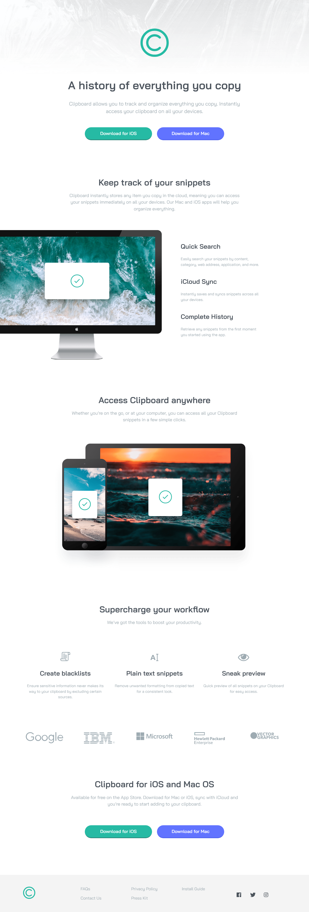

# Frontend Mentor - Clipboard landing page solution

This is a solution to the [Clipboard landing page challenge on Frontend Mentor](https://www.frontendmentor.io/challenges/clipboard-landing-page-5cc9bccd6c4c91111378ecb9). Frontend Mentor challenges help you improve your coding skills by building realistic projects. 

## Table of contents

- [Overview](#overview)
  - [The challenge](#the-challenge)
  - [Screenshot](#screenshot)
  - [Links](#links)
- [My process](#my-process)
  - [Built with](#built-with)
  - [What I learned](#what-i-learned)
  - [Continued development](#continued-development)
- [Author](#author)
- [Acknowledgments](#acknowledgments)


## Overview

### The challenge

Users should be able to:

- View the optimal layout for the site depending on their device's screen size
- See hover states for all interactive elements on the page

### Screenshot



### Links

- Solution URL: [Add solution URL here](https://your-solution-url.com)
- Live Site URL: [Add live site URL here](https://your-live-site-url.com)

## My process

### Built with

- Semantic HTML5 markup
- CSS custom properties
- Flexbox
- CSS Grid
- Mobile-first workflow

### What I learned

this time i didn't learn new things, but i took advantage of this challenge to put in practice all my knowledge. i got struggled
several times, but luckily i was able to solve all the problems and complete the challenge. The most remarkable thing was that
i used some grid properties that i wasn't so comfortable using.

```css
.third_sect > div {
  grid-template-columns: repeat(auto-fit, minmax(250px, 1fr));
}
```

### Continued development
I want to keep practicing and improving my frontend skills by putting in practice all my knowledge and acquiring new understanding.

## Author

- Frontend Mentor - [@dialejo24](https://www.frontendmentor.io/profile/dialejo24)
- Github - [@dialejo24](https://www.github.com/dialejo24)

## Acknowledgments

As i always, i want to thank all the people and corporations that kindly upload content to the internet for free and ease
the process of becoming a web developer. 
